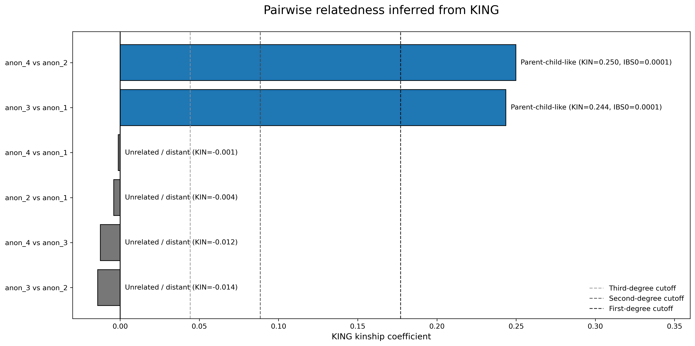

# Consumer DNA Relatedness Analyser

## Download
Clone or download this repository:

```bash
git clone https://github.com/Shiv276/consumer-dna-relatedness-analyser.git
cd consumer-dna-relatedness-analyser
```
Alternatively, select Code → Download ZIP on GitHub and extract the
downloaded folder.

Install the required Python packages if you don't already have them:
```bash
pip install -r requirements.txt
```

### Additional  Requirements
PLINK 1.9 and PLINK 2.0 must be installed separately and available through the
commands plink1.9 and plink2. You can check that they are available through the following:
```
plink1.9 --version
plink2 --version
```

A future graphical or web-based interface is also being considered to reduce the command-line and external dependency requirements. This may likely occur in the future when I create more 'broad-use' bioinformatic tools and function as a hub of popular tools for my own research rather than miscellaneous projects like this one.

## Usage:
The program accepts either individual DNA file paths or one folder containing
multiple supported DNA files.
#### Analyse Individual DNA Files:
```bash
python3 run_relatedness.py person1.txt person2.txt ...personN.txt -o results
```
Two or more files can be analysed in one run.

#### Analyse Every Supported File in a Folder:
```bash
python3 run_relatedness.py folder_containing_DNA_files -o results
```
The folder must contain at least two supported DNA files.

#### Important Flags:
- **-o** (Required)
  - The text following this flag will be the name of your output folder which will contain the intermediate and finalised files of all analysis, including a cleaned CSV and plot.

- **-v or --verbose** (Optional)
  - By default, most PLINK command output is hidden to keep the terminal readable. This flag will display all executed commands and detailed PLINK output.


## Description:

### A: Overview
Consumer DNA Relatedness Analyser is a local command-line program that estimates pairwise genetic relationships between two or more consumer DNA samples. The program outputs discrete categories of relatedness between individuals (e.g., parent–child, full siblings and second-degree relatives) using KING kinship and IBS0 statistics together with predefined relationship classification thresholds.

The program converts supported raw-DNA files into PLINK-compatible datasets,
merges their shared variants, calculates KING kinship and IBS0 statistics, and
produces a readable relationship table and visualisation.

#### **What kind of files will this work with?** 
The current version supports the two tab-delimited layouts shown below.
It has been tested with various providers.

Compatibility with every provider, chip version and export format is not
guaranteed. Files that contain no recognised SNP records will be rejected, however all tests using genomic data from public records have passed without error.<br>

In general, this tool will take '.txt' and '.tsv' files with four OR five columns as shown below:
```
# rsid	chromosome	position    genotype
rs3094315	1	752566  AA
rs12562034	1	768448	GG
rs3934834	1	1005806	CC
rs9442372	1	1018704	AG
...
```
OR
```
# rsid  chromosome  position    Allele1 Allele2
rs3094315	1	752566  A   A
rs12562034	1	768448	G   G
rs3934834	1	1005806	C   C
rs9442372	1	1018704	A   G
...
```
All major commercial DNA testing providers I've examined will provide raw genomic data in either of those two formats (note columns are tab-separated). The program can be updated to take new formats if they appear in the future

#### **Why is it useful?**
Consumer DNA files contain hundreds of thousands of SNP genotypes, but comparing
multiple files through tools such as PLINK and KING normally requires several
manual conversion, merging and filtering steps. This project combines those
steps into a single command-line workflow. <br>

This may help individuals uncover deeper insights on their relatedness between putative relatives using raw consumer DNA data they already possess, without going through the arduous bureaucratic processes revolved around legitimate genetic tests. All it requires is a commercial DNA test from any major provider. **Note, this intended is for education and exploratory analysis, and is not a substitute for accredited parentage, forensic, clinical or legal genetic testing.** Ethical and legal guidelines for the usage of a person's genomic data is very broad and detailed. You should have informed consent to analyse the genomic data of all people before using this tool.<br><br>


Pairwise analyses can be completed across files from different providers and will generally have enough SNP coverage for a statistically sound outcome regardless of build or provider. Consumer SNP arrays commonly share large numbers of rsIDs, however, the number and quality of usable variants depend on the providers,
genotyping chips, genome builds and individual files.

The current version reports the number of SNPs used by KING but does not yet
enforce a minimum shared-variant threshold. Cross-provider and mixed-build
results should therefore be interpreted cautiously. 

Preliminary testing across different providers has shown a minimum SNP agreement of 500,000 variants, however further testing is required to validate this. Refer to E: Future Upgrades and Limitations for further info on this.

------------


### B: Outputs
The selected output directory contains the intermediate PLINK files and final
analysis results.

user-facing outputs are stored in:

```text
results/
└── relatedness/
    ├── pairwise_relatedness.csv
    ├── pairwise_relatedness.png
    └── relatedness_all.kin0
```
There will also be four other folders containing intermediate files used throughout the analysis.

#### The main visual output is a horizontal plot showing the inferred relationship between every pair of samples.


There is also a cleaned CSV file outputted with basic summary statistics in order of KING coefficient in the following format:

|Pair            |Relation           |KINSHIP    |IBS0     |NSNP  |
|----------------|-------------------|-----------|---------|------|
|anon_4 vs anon_2|Parent-child-like  |0.249867   |8.92E-05 |549444|
|anon_3 vs anon_1|Parent-child-like  |0.243574   |9.74E-05 |554424|
|anon_4 vs anon_1|Unrelated / distant|-0.00122573|0.0624449|549653|
|anon_2 vs anon_1|Unrelated / distant|-0.00407754|0.0628642|554004|
|anon_4 vs anon_3|Unrelated / distant|-0.0124389 |0.0645601|549984|
|anon_3 vs anon_2|Unrelated / distant|-0.0141285 |0.0657395|554446|

--------

### C: The General Workflow / Pipeline
The program combines raw-DNA conversion, genotype filtering, dataset merging and
relatedness analysis into a single command-line workflow.

```text
Raw consumer DNA files
          │
          ▼
Format conversion
          │
          ▼
Individual PLINK datasets
          │
          ▼
Dataset merging and variant filtering
          │
          ▼
Duplicate-variant removal
          │
          ▼
KING pairwise relatedness analysis
          │
          ▼
Relationship classification
          │
          ▼
CSV table and PNG visualisation
```
#### **1. Input and dependency checks**

The program first checks that:

- PLINK 1.9 and PLINK 2.0 are installed and available through the commands
  `plink1.9` and `plink2`;
- at least two DNA files have been supplied;
- each input exists and uses a supported `.txt` or `.tsv` format; and
- each file contains recognisable SNP records.

The input filenames are also converted into safe sample identifiers for use in
the generated PLINK files.

#### **2. Raw-DNA format conversion**

Supported consumer DNA files may represent each genotype using either one
two-letter genotype column or two separate allele columns.

The conversion stage standardises both layouts into the following
PLINK-compatible format:

```text
rsID    chromosome    position    genotype
```
The converted files are stored in:

```text
converted_rawDNA/
```

#### **3. Individual PLINK dataset creation**

PLINK 1.9 processes each converted DNA file separately using `--23file`.

For each person, the program creates a binary PLINK dataset containing:

```text
sample.bed
sample.bim
sample.fam
```

Only autosomal SNPs with standard `A`, `C`, `G` and `T` alleles are retained.

These datasets are stored in:

```text
plink_samples/
```

#### **4. Dataset merging**

The individual PLINK datasets are then combined into one merged genotype
dataset.

The first sample is used as the base dataset, while the remaining samples are
included through a PLINK merge list.

#### **5. Incompatible-variant filtering**

The initial merge may fail when the same variant identifier is associated with
incompatible allele combinations across different files, often due to multiallelic variants

When this occurs, PLINK produces a `.missnp` file containing the variants that
prevented the merge. The program then:

1. Removes those variants from every individual dataset;
2. Stores the filtered datasets in `plink_samples_cleaned/`
3. Attempts the merge again.

This fallback allows many otherwise compatible datasets to be analysed without
requiring the user to perform the filtering manually.

#### **6. Duplicate-variant removal**

After a successful merge, PLINK 2 assigns chromosome-position identifiers to
the variants and removes duplicate records.

The final cleaned merged dataset is stored in:

```text
merged_files/
```

#### **7. KING relatedness analysis**

PLINK 2 calculates pairwise relatedness statistics for every combination of
samples using its KING implementation.

The main statistics used by the program are:

- **KINSHIP** - an estimate of the genetic relatedness between two samples;
- **IBS0** - the proportion of analysed variants at which the pair shares no
  allele identical by state; and
- **NSNP** - the number of autosomal variants contributing to the pairwise
  comparison.

The original KING output is saved as:

```text
relatedness/relatedness_all.kin0
```

#### **8. Relationship classification**

Each sample pair is assigned a relationship category using its KING kinship
coefficient.

Pairs within the first-degree kinship range are further classified as
`Parent-child-like` or `Full-sibling-like` using their IBS0 value.

The thresholds and scientific basis for these classifications are described in
the [Relationship Classification](#d-relationship-classification)
section below.


#### **9. Final outputs**

The sample pairs are ordered from highest to lowest kinship coefficient.

The program then produces:

- a cleaned CSV table containing the pairwise statistics and predicted
  relationships;
- a horizontal plot summarising the inferred relationships; and
- the original KING output table.

These files are stored in the `relatedness/` output folder.
<br>
<br>


### D: Relationship Classification


The main degree categories follow the relationship-classification criteria
described by Manichaikul et al. (2010) in the original KING publication. The expected
kinship coefficients are approximately:

| Relationship degree | Expected kinship |
|---|---:|
| Duplicate samples / identical twins | 0.500 |
| First-degree relatives | 0.250 |
| Second-degree relatives | 0.125 |
| Third-degree relatives | 0.0625 |
| Unrelated individuals | approximately 0 |

Because observed estimates do not fall exactly on these expected values, KING
uses boundaries halfway between successive relationship levels on a geometric
scale. This program therefore applies the following ranges:

| Program classification | KING kinship range |
|---|---:|
| Duplicate / identical twin | ≥ 0.3536 |
| First-degree | ≥ 0.1768 and < 0.3536 |
| Second-degree | ≥ 0.0884 and < 0.1768 |
| Third-degree | ≥ 0.0442 and < 0.0884 |
| Unrelated / distant | < 0.0442 |

These boundaries correspond to:

- `2⁻³ᐟ² ≈ 0.3536`
- `2⁻⁵ᐟ² ≈ 0.1768`
- `2⁻⁷ᐟ² ≈ 0.0884`
- `2⁻⁹ᐟ² ≈ 0.0442`

These values were directly taken from the original KING publication.<br><br>

The KING kinship coefficient alone cannot distinguish a parent-child pair from
a full-sibling pair because both are first-degree relationships with an
expected kinship coefficient of approximately 0.25.

To separate these categories, the program also uses `IBS0`; the proportion of
analysed variants at which the two individuals share no allele. Parent and
child are expected to share at least one allele at almost every autosomal
variant, so their IBS0 value should be close to zero. Full siblings can inherit
different alleles from both parents and therefore normally have a higher IBS0
value.

Within the first-degree kinship range, this program uses the following rule:

| First-degree classification | Additional criterion |
|---|---:|
| Parent-child-like | IBS0 < 0.0012 |
| Full-sibling-like | IBS0 ≥ 0.0012 |

The IBS0 threshold of `0.0012` follows criteria applied to UK Biobank
SNP-array data by Hofmeister et al. (2022). Their parent-offspring identification also
used age and pedigree-related information that is not available to this
program. For this reason, the program reports **parent-child-like** and
**full-sibling-like**, rather than treating these labels as definitive
conclusions.
<br>
<br>


### E: Future Upgrades and Limitations

#### Current limitation 1: Genome Builds
Consumer DNA files have been seen to report genomic positions using different human genome
assemblies, including hg18, hg19 and hg38.

The current version does not automatically detect or harmonise genome builds.
Files from different builds may still share large numbers of rsIDs and produce
KING estimates, but PLINK may report many warnings because the same rsID has
different coordinates between assemblies.

Mixed-build inputs are therefore not formally supported. Users should
preferably analyse files using the same genome build which is often guaranteed when using recent data generated from the same provider.

#### → The Fix:
Multi-marker build detection and build harmonisation algorithms have already been designed, and are seen to function successfully through preliminary testing, however they are still unrefined and need further work to integrate into my current pipeline. <br>

The program in its current form ignores changes in chromosomal coordinates when two SNP variants share a rsID but differ in position. As such, SNPs with the same rsID are considered to be the same variant call. Through observation in various datasets, changes in chromosomal coordinates generally appear to be minimal, and strongly associated with different genome assemblies which has no statistical effect on rsID integrity. Regardless, rsIDs can have complicated mapping histories and not always maintain their identity. Therefore, the genomic build harmoniser is a fairly necessary path for the future.
<br>
<br>
#### Overall Limitations
Relationship estimates may be affected by:

- Genotyping Errors;
- Differences between genotyping chips;
- Low SNP overlap;
- Genome-build differences;
- Allele or strand inconsistencies;
- Population structure;
- Unusual or complex biological relationships.

More distant relationships have greater overlap in their expected kinship distributions and should therefore be interpreted with increasing caution.
<br>
<br>
These limitations are largely controlled for either by the statistical power and robustness of KING analysis, using its relevant publications to resolve uncertainty, or by preliminary build-harmonisation which will be expanded on at a later stage.

--------------
--------------

### References

1. Hofmeister RJ, Rubinacci S, Ribeiro DM, Buil A, Kutalik Z, Delaneau O. Parent-of-Origin inference for biobanks. Nat Commun. 2022 Nov 5;13(1):6668. doi: 10.1038/s41467-022-34383-6. PMID: 36335127; PMCID: PMC9637181.

2. Manichaikul A, Mychaleckyj JC, Rich SS, Daly K, Sale M, Chen WM. Robust relationship inference in genome-wide association studies. Bioinformatics. 2010 Nov 15;26(22):2867-73. doi: 10.1093/bioinformatics/btq559. Epub 2010 Oct 5. PMID: 20926424; PMCID: PMC3025716.

--------------
### Privacy

Raw DNA files contain highly sensitive and potentially identifying genetic
information.

This program runs locally and does not intentionally upload data to an external
service. Users are responsible for obtaining consent before analysing another
person's genetic information.


### Disclaimer

This software is intended for educational, research and exploratory use only.

It must not be used as the sole basis for medical, legal, forensic, immigration,
inheritance or parentage decisions. Use an appropriately accredited genetic
testing service when a formally verified result is required.

--------------
